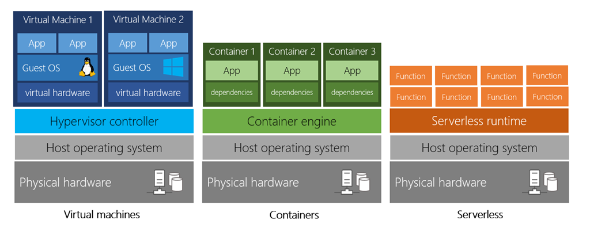
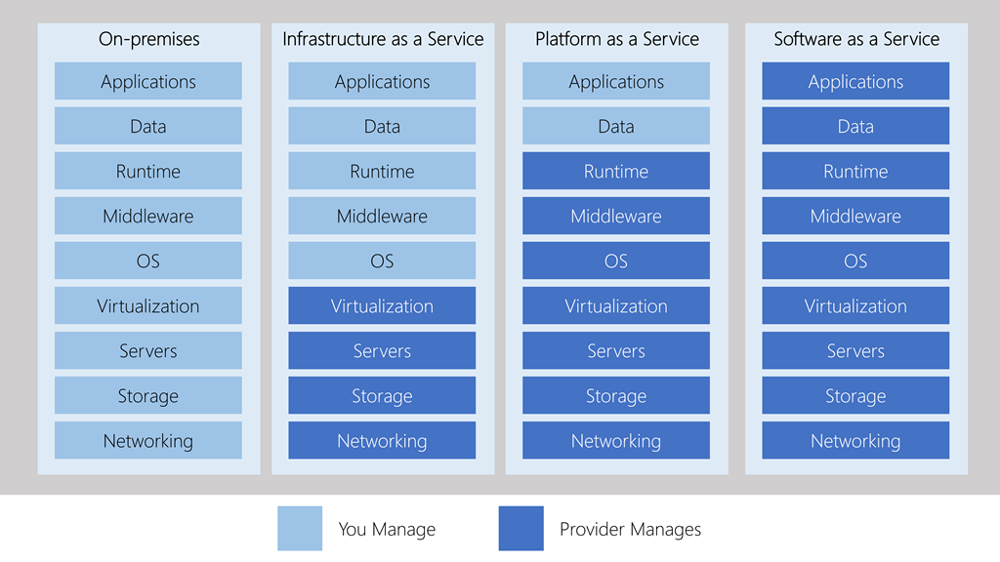
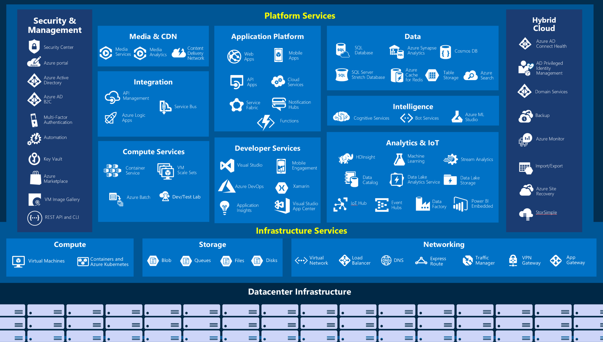

# Learn Azure

> Links, resources, and code related to my learning of `Microsoft Azure` cloud services.

---

[Microsoft Azure](https://azure.microsoft.com/en-us/) is a cloud computing service for building,
testing, deploying, and managing applications and services through Microsoft-managed data centers.
It provides software as a service (SaaS), platform as a service (PaaS) and infrastructure as a service (IaaS).

---

## Documentation

* [Links and Resources](./docs/links.md)
* [Tools and Utilities](./docs/tools.md)

[](.)

* [Azure DevOps](./docs/devops.md)

---

## VM vs. Container vs. Serverless



## IaaS vs. PaaS vs. SaaS



## Azure Services Overview



---

## Project Structure

```md
.
├── .husky               # Husky configuration
├── docs                 # Documentation
│  ├── devops.md         # Azure DevOps
│  ├── links.md          # Azure Services
│  └── tools.md          # Tools & Utilities
├── media                # Media assets
├── pipelines            # Azure Pipelines examples
├── scripts              # Utility scripts
├── .commitlintrc        # Commitlint configuration
├── .editorconfig        # Editor configuration
├── .gitignore           # Git ignore rules
├── .np-config.json      # NPM publish (np) configuration
├── LICENSE              # Project LICENSE
├── package.json         # NPM package configuration
└── README.md            # Project README
```

---
